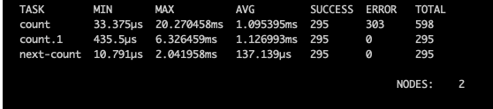

# Asyncp processing framework

[](https://github.com/demdxx/asyncp/actions?workflow=run%20tests)
[](https://coveralls.io/github/demdxx/asyncp?branch=master)
[](https://goreportcard.com/report/github.com/demdxx/asyncp)
[](https://godoc.org/github.com/demdxx/asyncp)

> License Apache 2.0

The simple framework to build async task execution programs.

## Pipelines

Sequentially apply a list of tasks. Pipelines allow to split one big
processing part for small simple steps to simplify the complex logic.

The pipeline is atomic, all tasks in the pipeline will successfully
execute the whole task or all not.

## Example program

```go
import (
  ...
  "github.com/demdxx/asyncp"
  "github.com/demdxx/asyncp/streams"
  ...
)

func main() {
  taskQueueSub := nats.NewSubscriber(...)
  taskQueuePub := nats.NewPublisher(...)

  // Create new async multiplexer
  mx := asyncp.NewTaskMux(
    // Define default strem message queue
    asyncp.WithStreamResponseFactory(taskQueuePub),
    asyncp.WithPanicHandler(...),
    asyncp.WithErrorHandler(...),
    asyncp.WithCluster(...),
  )
  defer func() { _ = mx.Close() }()

  // Create new task handler to download articles by RSS
  mx.Handle("rss", downloadRSSList).
    Then(downloadRSSItem).
    Then(updateRSSArticles)

  // Create new task handler to process video files
  mx.Handle("video", loadVideoForProcessing).
    Then(makeVideoThumbs).
    Then(convertVideoFormat)

  // Send report to user (event contains login and email target)
  mx.Handle("email", pipeline.New(
    `userinfo`, assembleBasicInfo,
    `changes`, assembleAllChangesForUser,
    `template`, assembleEmailHTMLTemplate,
    pipeline.New(
      sendNotification,
      sendSendLogs,
    ),
  )).Then(sendEmailTask)

  // Retranslate all message to the queue if can`t process
  mx.Failver(asyncp.Retranslator(taskQueuePub))

  // Alternative:
  // taskQueueSub.Subscribe(context.Background(), mx)
  // taskQueueSub.Listen(context.Background())
  err = streams.ListenAndServe(context.Background(), mx,
    taskQueueSub, "nats://host:2222/group?topics=topicName")
}
```

Convert task to async executor.

```go
atask := asyncp.WrapAsyncTask(task,
  WithWorkerCount(10),
  WithWorkerPoolSize(20),
  WithRecoverHandler(func(rec interface{}) {
    // ...
  }))

// Or

asyncp.FuncTask(assembleBasicInfo).Async()
```

## Cluster mode

The framework supports cluster task processing.
Some of the servers can execute some specific tasks like video processing or windows specific stuff.

To extend cluster base functionality need to create in other applications (with the same sync options)
linked task `baseHandlerTaskName>myNewClusterTask`.

```go
func main() {
  ...
  // After RSS parsing we need to prcess video files from links if it's present
  mx.Handle("rss>videoExtraction", loadVideoForProcessing).
    Then(makeVideoThumbs).
    Then(convertVideoFormat)
  ...
}
```

## Apmonitor tool

Displays state of the cluster and every task common state.


